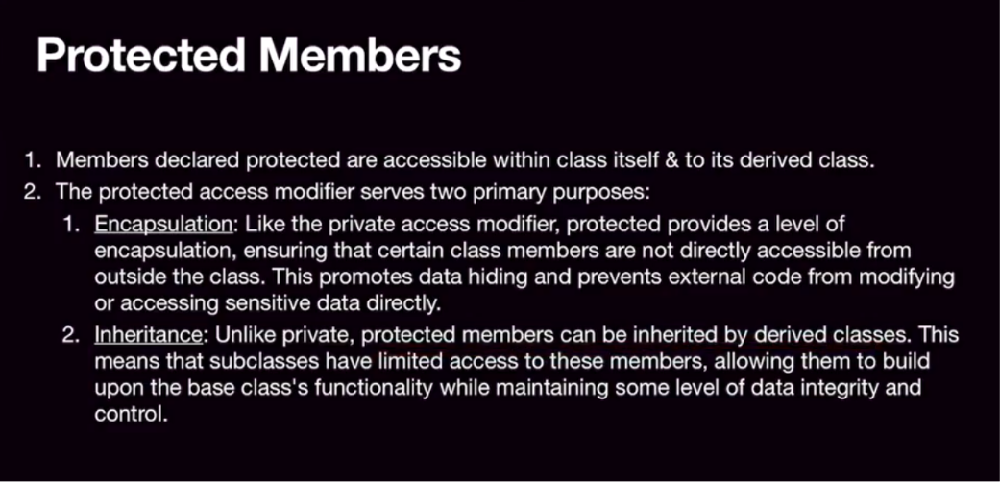
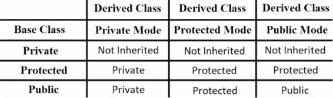
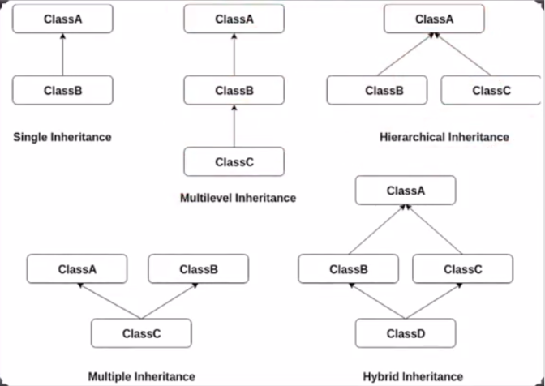
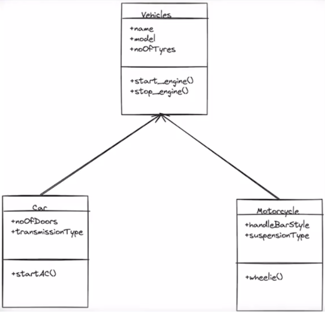

# OOP in CPP

## Class and Objects

```cpp
class student
{
private:
    string name;
    int id;
    long long sid;

public:
    student()
    {
        cout << this->name << "'s constructor called" << endl;
    }
    student(string name, int id, long long sid)
    {
        this->name = name;
        this->id = id;
        this->sid = sid;
        cout << this->name << "'s constructor called" << endl;
    }
    void getdata()
    {
        cout << this->name << ", " << this->id << ", " << this->sid << "\n";
    }
    ~student()
    {
        cout << this->name << "'s destructor called" << endl;
    }
};
```

### Static Allocation

`student a("rohan", 55, 123321);`
No `new` keyword used - stored statically as **object**.

Stores all the info automatically using **Parameterised** _constructor_.
**STATIC ALLOCATION -> auto-destroyed**

### Dynamic Allocation

`student *b = new student("baloo", 12, 142324);`
Stored dynamically as **pointer**.

`delete(b);` **MUST** be called manually - else Memory leak happens.
**DYNAMIC ALLOCATION -> call destructor manually**

## Encapsulation (Data Hiding)

### Theory

- Binds data and methods in class
- Functions:
  - Providex secure layer
  - Hides internal implementation of code and data in class
  - Exposes only necessary information to external world
- Prevent unauth access/modificaton of original contents of class by instances (objects)
- Prevent exposure of underlying algorithms (working details) of data members to outer world (many times: `int main()`)

### Access Modifiers

**Default**: _`private`_

**Private**:

- Access from same class ONLY
- **Cannot** be accessed from Derived
- **Cannot** be accessed from `main()`

**Protected**:

- Access from same class
- Access from Derived
- **Cannot** be accessed from `main()`

**Public**:

- Access from same class
- Access from Derived
- Access from `main()`


## Inheritance

### Theory

- Child inherits attrivutes and behaviours from Parent
- Way to create _class_ from existing _class_
- _Derived/Child/Sub_ classinherits from _Base/Parent/Super_ class
- _Protected_ can be accessed by sub-classes

### Access Specifier - Protected



**Question:** What _scope_ of attributes of parents will be inherited to child class and with what _scope_?



### When to Use?

- **IS-A** relationship
- Hierarchical relationship
- Specialised-Generalized connection

### Types

C++ supports several types of inheritance:

- **Single Inheritance**: A derived class with only one base class.
- **Multiple Inheritance**: A derived class with multiple base classes.
- **Multilevel Inheritance**: A class derived from another derived class.
- **Hierarchical Inheritance**: Multiple classes derived from a single base class.
- **Hybrid Inheritance**: A combination of two or more types of inheritance.



### Importance

- **Code Reusability**: Avoids redundancy by enabling child classes to reuse methods and properties of parent classes.
- **Extensibility**: Easy to extend existing code for new requirements.
- **Maintenance**: Simplified adjustments with changes concentrated in base classe

### Example



---

### With God's Grace

#### DKT_Ekantik
