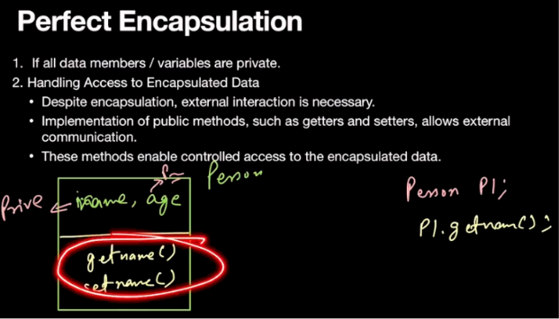

# OOP in CPP

## Class and Objects

```cpp
class student
{
private:
    string name;
    int id;
    long long sid;

public:
    student()
    {
        cout << this->name << "'s constructor called" << endl;
    }
    student(string name, int id, long long sid)
    {
        this->name = name;
        this->id = id;
        this->sid = sid;
        cout << this->name << "'s constructor called" << endl;
    }
    void getdata()
    {
        cout << this->name << ", " << this->id << ", " << this->sid << "\n";
    }
    ~student()
    {
        cout << this->name << "'s destructor called" << endl;
    }
};
```

### Static Allocation

`student a("rohan", 55, 123321);`
No `new` keyword used - stored statically as **object**.

Stores all the info automatically using **Parameterised** _constructor_.
**STATIC ALLOCATION -> auto-destroyed**

### Dynamic Allocation

`student *b = new student("baloo", 12, 142324);`
Stored dynamically as **pointer**.

`delete(b);` **MUST** be called manually - else Memory leak happens.
**DYNAMIC ALLOCATION -> call destructor manually**

## Encapsulation (Data Hiding)

### Theory

- Binds data and methods in class
- Functions:
  - Providex secure layer
  - Hides internal implementation of code and data in class
  - Exposes only necessary information to external world
- Prevent unauth access/modificaton of original contents of class by instances (objects)
- Prevent exposure of underlying algorithms (working details) of data members to outer world (many times: `int main()`)

### Access Modifiers

**Default**: _`private`_

**Private**:

- Access from same class ONLY
- **Cannot** be accessed from Derived
- **Cannot** be accessed from `main()`

**Protected**:

- Access from same class
- Access from Derived
- **Cannot** be accessed from `main()`

**Public**:

- Access from same class
- Access from Derived
- Access from `main()`



---

### With God's Grace

#### DKT_Ekantik
